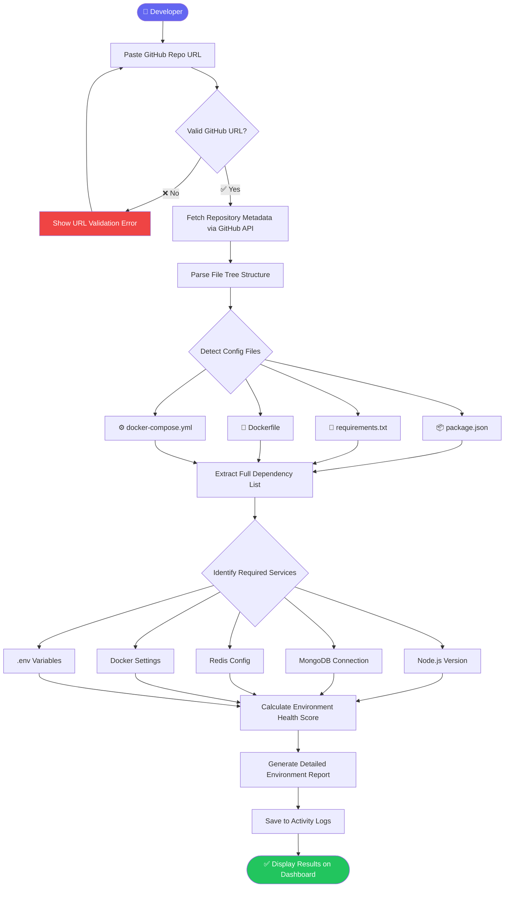
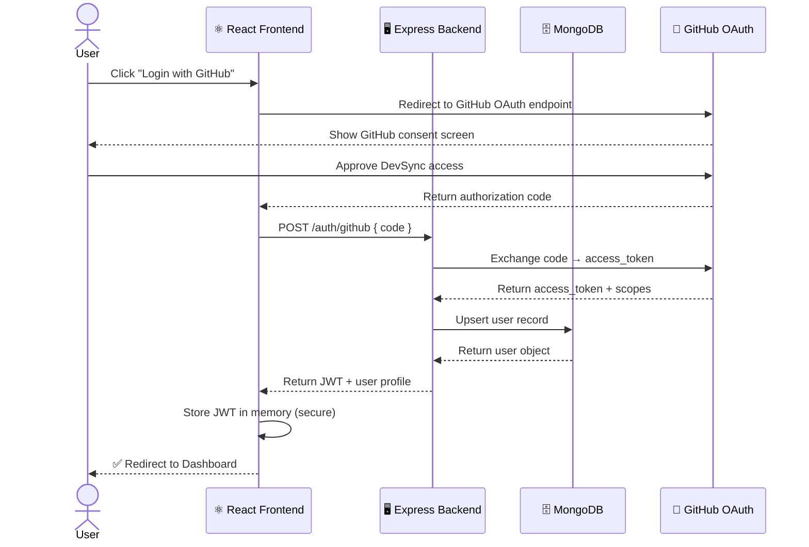
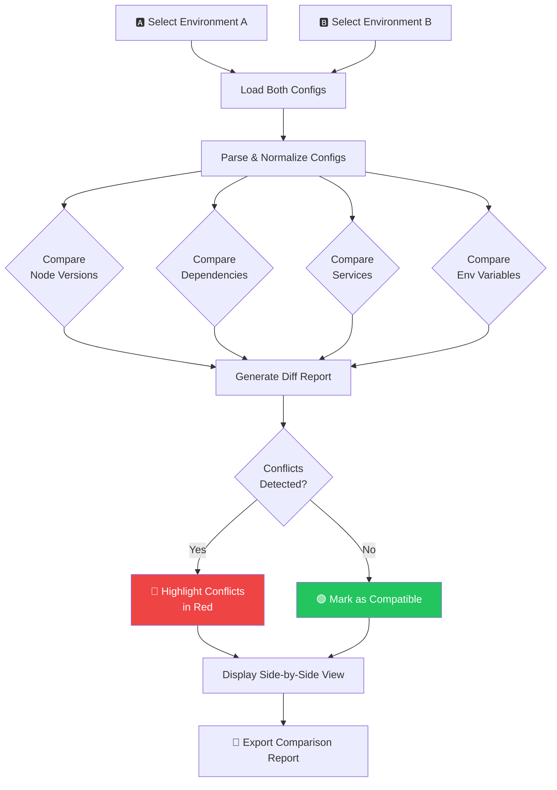
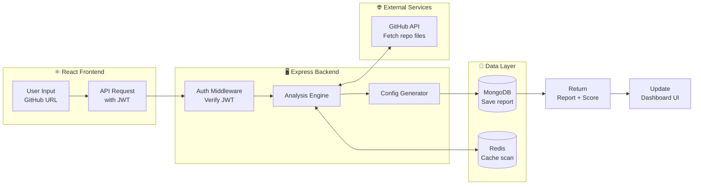

<div align="center">


# 🔄 DevSync — Auto Environment Sync Platform

### *Stop configuring. Start coding.*

**DevSync analyzes your GitHub repositories and auto-generates fully synced, ready-to-run environment configurations — before you write a single line of code.**

<br/>

[](https://reactjs.org/)
[](https://vitejs.dev/)
[](https://tailwindcss.com/)
[](https://nodejs.org/)
[](https://mongodb.com/)
[](#license)
[](https://github.com/Riyaban583/Auto-Environment-Sync-Platform/pulls)
[](https://github.com/Riyaban583/Auto-Environment-Sync-Platform/stargazers)

<br/>

[🧩 Problem](#-the-problem) · [💡 Solution](#-our-solution) · [✨ Features](#-features) · [🏗 Architecture](#-system-architecture) · [🔄 Flowcharts](#-core-workflows) · [🚀 Getting Started](#-getting-started) · [👥 Contributors](#-contributors) · [🗺 Roadmap](#-roadmap)

</div>

---

## 🧩 The Problem

Every developer has experienced this moment of frustration — you clone a promising repository, run the project, and immediately hit a **wall of errors**:

```bash
$ npm run dev

❌ Error: Node version mismatch. Required: 18.x, Found: 16.x
❌ MongooseError: MongoDB connection refused at localhost:27017
❌ Error: Missing environment variable REDIS_URL
❌ Error: Cannot find module 'dotenv'
❌ Docker: Cannot connect to the Docker daemon
```

> **The average developer wastes 4.5 hours per week** just setting up and syncing development environments. That's over **200 hours a year** — lost to configuration, not creation.

### 🔍 Root Causes We Identified

| Pain Point | Impact |
|:-----------|:-------|
| 🔀 **Node/Python version mismatches** | App crashes before it even starts |
| 🗄️ **Unconfigured databases** | Missing MongoDB, Redis, or PostgreSQL connections |
| 🔑 **Missing `.env` variables** | Silent failures that are hard to debug |
| 🐳 **Docker misconfiguration** | Container builds fail or services don't link |
| 📦 **Undocumented dependencies** | Hours spent reverse-engineering setup steps |
| 👥 **Onboarding new team members** | Days lost getting a dev up and running |

---

## 💡 Our Solution

**DevSync** is an intelligent environment synchronization platform that **reads your repository**, **understands your stack**, and **generates everything you need** to start coding immediately.

```
You paste a GitHub URL  →  DevSync scans the repo  →  You get a ready-to-run environment
                                    ⬇
         No more "works on my machine" — it works on every machine.
```

### ✅ What DevSync Does For You

- 🔍 **Scans** `package.json`, `Dockerfile`, `docker-compose.yml`, `requirements.txt` automatically
- ⚙️ **Detects** exact runtime versions (Node.js, Python, etc.) your project needs
- 🩺 **Scores** your environment health and tells you exactly what's missing
- 📋 **Generates** a complete setup report saved to your activity log
- 🔀 **Compares** environments side-by-side to catch version conflicts before they happen
- 🔗 **Connects** directly to your GitHub account for seamless repo access

---

## ✨ Features

<table>
<tr>
<td width="50%">

### 🔍 Repository Analysis
Deep-scans any GitHub repository URL. Detects your stack, maps dependencies, and identifies all configuration requirements automatically — no manual input needed.

</td>
<td width="50%">

### ⚙️ Environment Detection
Identifies Node.js versions, MongoDB connections, Redis configs, Docker setups, and missing `.env` variables with precision. Knows what your app needs before you do.

</td>
</tr>
<tr>
<td width="50%">

### 🩺 Health Monitoring
Assigns a real-time health score (0–100) to your environment. Flags critical issues, warnings, and what's passing — so you know exactly where to focus.

</td>
<td width="50%">

### 🔀 Environment Comparison
Side-by-side diff of two environments. Highlights version conflicts, missing services, and incompatible variables so you can resolve issues before merging or deploying.

</td>
</tr>
<tr>
<td width="50%">

### 📋 Activity Logs
Full history of every scan. Every report is stored, searchable, and detailed — perfect for auditing environment changes over time.

</td>
<td width="50%">

### 🔗 GitHub Integration
OAuth-powered connection to your GitHub account. Browse, select, and analyze any repository you own or have access to, without copy-pasting URLs.

</td>
</tr>
</table>

---

## 🏗 System Architecture

The diagram below shows the complete high-level architecture of DevSync — from browser to GitHub API and back.

```
┌──────────────────────────────────────────────────────────────────────┐
│                        DevSync Platform                              │
│                                                                      │
│   ┌─────────────────────────┐         ┌──────────────────────────┐   │
│   │    React Frontend        │◄──────►│   Node.js Backend        │   │
│   │    (Vite + Tailwind)     │  REST   │   (Express.js)           │   │
│   │                          │  API    │                          │   │
│   │  ┌──────────────────┐   │         │  ┌────────────────────┐  │   │
│   │  │  Pages           │   │         │  │  Analysis Engine   │  │   │
│   │  │  • Dashboard     │   │         │  │  • Repo scanner    │  │   │
│   │  │  • Sync          │   │         │  │  • Dep detector    │  │   │
│   │  │  • Environments  │   │         │  │  • Score generator │  │   │
│   │  │  • Compare       │   │         │  └────────────────────┘  │   │
│   │  │  • Logs          │   │         │                          │   │
│   │  │  • Settings      │   │         │  ┌────────────────────┐  │   │
│   │  └──────────────────┘   │         │  │  Auth Layer        │  │   │
│   │                          │         │  │  • JWT tokens      │  │   │
│   │  ┌──────────────────┐   │         │  │  • GitHub OAuth    │  │   │
│   │  │  Components      │   │         │  └────────────────────┘  │   │
│   │  │  • Sidebar       │   │         │                          │   │
│   │  │  • StatsCard     │   │         │  ┌────────────────────┐  │   │
│   │  └──────────────────┘   │         │  │  Config Generator  │  │   │
│   └─────────────────────────┘         │  │  • .env templates  │  │   │
│                                        │  │  • Docker compose  │  │   │
│                                        │  └────────────────────┘  │   │
│                                        └──────────┬───────────────┘   │
│                                                   │                   │
│                             ┌─────────────────────┼─────────────┐     │
│                             │                     │             │     │
│                      ┌──────▼──────┐    ┌─────────▼──────┐     │     │
│                       │  MongoDB   │    │  GitHub API    │     │     │
│                       │  Storage   │    │  Repo Access   │     │     │
│                       └────────────┘    └────────────────┘     │     │
│                                                                 │     │
│                      ┌─────────────────────────────────────┐   │     │
│                      │  Redis (Planned) — Caching Layer    │   │     │
│                      └─────────────────────────────────────┘         │
└──────────────────────────────────────────────────────────────────────┘
```

### 🧱 Architecture Layers Explained

| Layer | Technology | Responsibility |
|:------|:-----------|:---------------|
| **Frontend** | React 18 + Vite + Tailwind | UI, routing, user interactions |
| **Backend API** | Node.js + Express.js | Business logic, repo analysis, config generation |
| **Auth** | GitHub OAuth + JWT | Secure login and session management |
| **Database** | MongoDB | User data, scan history, environment configs |
| **Cache** | Redis *(planned)* | Speed up repeated repo scans |
| **External API** | GitHub REST API | Fetch repository metadata and file contents |

---

## 🔄 Core Workflows

### 1️⃣ Repository Analysis Flow

> *What happens when you paste a GitHub URL into DevSync*



---

### 2️⃣ Environment Health Check Flow

> *How DevSync scores your environment readiness (0–100)*

```mermaid
flowchart LR
    A([▶ Start Health Check]) --> B[Load Environment Config]
    B --> C{Node.js\nVersion Match?}

    C -- ✅ Pass --> D{MongoDB\nReachable?}
    C -- ❌ Fail --> C1[🚩 Flag: Version Mismatch\n−15 pts]
    C1 --> D

    D -- ✅ Pass --> E{Redis\nConfigured?}
    D -- ❌ Fail --> D1[🚩 Flag: DB Unavailable\n−20 pts]
    D1 --> E

    E -- ✅ Pass --> F{Env Variables\nPresent?}
    E -- ⚠️ Optional --> E1[⚠ Warn: Optional Service\n−5 pts]
    E1 --> F

    F -- ✅ Pass --> G{Docker\nConfig Valid?}
    F -- ❌ Fail --> F1[🚩 Flag: Missing .env\n−25 pts]
    F1 --> G

    G --> H[Compute Final Score]
    H --> I{Score Range?}

    I -- 90–100 --> J[🟢 Ready to Code]
    I -- 70–89  --> K[🟡 Warnings Present]
    I -- 0–69   --> L[🔴 Critical Issues Found]

    style J fill:#22c55e,color:#fff
    style K fill:#f59e0b,color:#fff
    style L fill:#ef4444,color:#fff
```



---

### 3️⃣ GitHub OAuth Authentication Flow

> *How DevSync securely logs you in with your GitHub account*



---

### 4️⃣ Environment Comparison Flow

> *How DevSync diffs two environments to catch conflicts*



---

### 5️⃣ Data Flow — End to End

> *The complete journey of a scan request through the DevSync system*



---

## 📁 Project Structure

```
devsync-frontend/
│
├── 📂 public/
│   └── favicon.ico
│
├── 📂 src/
│   │
│   ├── 📂 routes/
│   │   └── AppRoutes.jsx          # Central route config (React Router)
│   │
│   ├── 📂 layouts/
│   │   └── MainLayout.jsx         # Shared shell with Sidebar + Outlet
│   │
│   ├── 📂 components/
│   │   ├── Sidebar.jsx            # Navigation sidebar with active states
│   │   └── StatsCard.jsx          # Reusable metric/KPI card component
│   │
│   ├── 📂 pages/
│   │   ├── Login.jsx              # GitHub OAuth sign-in landing page
│   │   ├── Dashboard.jsx          # Overview: health scores & recent scans
│   │   ├── Sync.jsx               # GitHub URL input & repo analysis trigger
│   │   ├── Environments.jsx       # View all detected environment configs
│   │   ├── Compare.jsx            # Side-by-side environment diff tool
│   │   ├── Logs.jsx               # Full scan history & detailed reports
│   │   └── Settings.jsx           # GitHub integration & user preferences
│   │
│   ├── 📂 hooks/                  # Custom React hooks (planned)
│   ├── 📂 utils/                  # Utility/helper functions (planned)
│   │
│   ├── App.jsx                    # Root component & provider setup
│   ├── main.jsx                   # ReactDOM entry point
│   └── index.css                  # Global Tailwind styles
│
├── index.html                     # HTML entry point
├── vite.config.js                 # Vite bundler configuration
├── tailwind.config.js             # Tailwind theme configuration
└── package.json                   # Dependencies & npm scripts
```

---

## 🛠 Tech Stack

### 🎨 Frontend *(Current)*

| Technology | Version | Purpose |
|:-----------|:--------|:--------|
|  **React.js** | 18.x | Component-based UI architecture |
|  **Vite** | 5.x | Lightning-fast dev server & bundler |
|  **Tailwind CSS** | 3.x | Utility-first responsive styling |
| **React Router DOM** | 6.x | Client-side SPA routing |
| **Lucide React** | Latest | Consistent icon library |

### ⚙️ Backend *(Planned)*

| Technology | Purpose |
|:-----------|:--------|
|  **Node.js + Express** | REST API server & middleware |
|  **MongoDB** | User data & scan history storage |
|  **JWT** | Stateless session authentication |
| **GitHub REST API** | Repository metadata & file access |

### 🚀 Infrastructure *(Future)*

| Technology | Purpose |
|:-----------|:--------|
|  **Redis** | Caching repeated scan results |
|  **Docker** | Containerized deployment |
| **AI / LLM** | Smart environment fix recommendations |

---

## 🚀 Getting Started

### Prerequisites

Make sure you have the following installed:

- ✅ **Node.js** `>= 18.x` — [Download](https://nodejs.org/)
- ✅ **npm** `>= 9.x` — comes with Node.js
- ✅ **Git** — [Download](https://git-scm.com/)

### Installation

**Step 1 — Clone the repository**

```bash
git clone https://github.com/Riyaban583/Auto-Environment-Sync-Platform.git
cd devsync-frontend
```

**Step 2 — Install dependencies**

```bash
npm install
```

**Step 3 — Configure environment**

```bash
cp .env.example .env
```

Then open `.env` and fill in your GitHub OAuth credentials:

```env
VITE_GITHUB_CLIENT_ID=your_github_client_id
VITE_GITHUB_REDIRECT_URI=http://localhost:5173/auth/callback
```

**Step 4 — Start the development server**

```bash
npm run dev
```

Open [http://localhost:5173](http://localhost:5173) in your browser. 🎉

### Build for Production

```bash
npm run build      # Build optimized bundle
npm run preview    # Preview production build locally
```

---

## 🖥 Application Screens

| Screen | Route | Description |
|:-------|:------|:------------|
| 🔐 **Login** | `/` | GitHub OAuth sign-in with clean landing UI |
| 📊 **Dashboard** | `/dashboard` | Overview of recent scans, health scores, and activity stats |
| 🔄 **Repository Sync** | `/sync` | Paste any GitHub URL to trigger instant environment analysis |
| ⚙️ **Environments** | `/environments` | Browse all detected environment configurations |
| 🔀 **Environment Comparison** | `/compare` | Side-by-side diff of two environments |
| 📋 **Activity Logs** | `/logs` | Complete history of all repository scans and reports |
| 🛠 **Settings** | `/settings` | Manage GitHub integration and notification preferences |

---

## 👥 Contributors

This project was built with passion by:

<table>
<tr>

<td align="center" width="50%">
<br/>

### 👨‍💻 Akshat Srivastava

[](https://github.com/AkshatSrivastava)

**Role:** Full-Stack Developer & System Architect

**Contributions:**
- 🏗 Designed the overall system architecture and data flow
- ⚙️ Built the Repository Analysis Engine logic
- 🔗 Implemented GitHub API integration layer
- 🩺 Developed the Environment Health Scoring algorithm
- 🔐 Architected the JWT + OAuth authentication flow
- 📊 Built the Environment Comparison (diff) module
- 🗄 Designed MongoDB schema for users and scan history

</td>

<td align="center" width="50%">
<br/>

### 👩‍💻 Riya Bansal

[](https://github.com/Riyaban583)

**Role:** Frontend Developer & UI/UX Lead

**Contributions:**
- 🎨 Designed and built the complete React frontend
- 🧭 Set up React Router DOM routing & layout system
- 🖥 Developed all 7 application screens (Dashboard, Sync, Compare, Logs, etc.)
- 📦 Created reusable component library (Sidebar, StatsCard)
- 💅 Implemented Tailwind CSS design system & responsive layouts
- 🔄 Integrated frontend with REST API endpoints
- 📋 Built the Activity Logs UI and scan history views

</td>

</tr>
</table>

<div align="center">

---

*Built together as part of a hackathon project. Questions? Open an [issue](https://github.com/Riyaban583/Auto-Environment-Sync-Platform/issues) or start a [discussion](https://github.com/Riyaban583/Auto-Environment-Sync-Platform/discussions).*

</div>

---

## 🗺 Roadmap

```
╔══════════════════════════════════════╗   ╔══════════════════════════════════════╗
║   Phase 1 — Foundation ✅ DONE       ║   ║   Phase 2 — Backend Integration 🔧   ║
╠══════════════════════════════════════╣   ╠══════════════════════════════════════╣
║  ✅ React frontend scaffold           ║   ║  🔲 Node.js + Express REST API        ║
║  ✅ Routing & layout system           ║   ║  🔲 MongoDB integration & schemas     ║
║  ✅ Dashboard UI                      ║   ║  🔲 GitHub OAuth flow                 ║
║  ✅ Sync, Compare, Logs, Settings     ║   ║  🔲 Repository analysis engine        ║
║  ✅ Stats cards & sidebar nav         ║   ║  🔲 JWT authentication middleware     ║
╚══════════════════════════════════════╝   ╚══════════════════════════════════════╝

╔══════════════════════════════════════╗   ╔══════════════════════════════════════╗
║   Phase 3 — Intelligence 🤖          ║   ║   Phase 4 — Scale & Collaboration 🌍 ║
╠══════════════════════════════════════╣   ╠══════════════════════════════════════╣
║  🔲 Redis caching layer               ║   ║  🔲 Team collaboration features       ║
║  🔲 Docker Compose auto-generation    ║   ║  🔲 Cloud deployment support          ║
║  🔲 AI-powered fix recommendations    ║   ║  🔲 Real-time environment monitoring  ║
║  🔲 Auto .env variable detection      ║   ║  🔲 Webhook integrations              ║
║  🔲 Repository auto-scan on push      ║   ║  🔲 VS Code extension                 ║
╚══════════════════════════════════════╝   ╚══════════════════════════════════════╝
```

---

## 🤝 Contributing

Contributions are welcome! Here's how to get involved:

1. **Fork** the repository
2. **Create** a feature branch: `git checkout -b feat/your-feature-name`
3. **Commit** your changes: `git commit -m "feat: add your feature"`
4. **Push** to your branch: `git push origin feat/your-feature-name`
5. **Open** a Pull Request 🎉

Please follow [Conventional Commits](https://www.conventionalcommits.org/) for commit messages.

---

## 📄 License

This project was developed for **educational, academic, and hackathon** purposes.

---

<div align="center">

Made with ❤️ by **Akshat Srivastava** & **Riya Bansal**

⭐ **Star this repo if DevSync saved you from environment hell!** ⭐

*Stop configuring. Start coding.*

</div>
