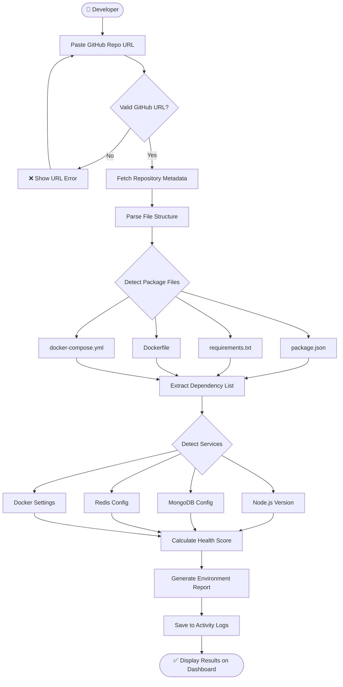
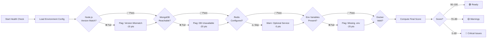
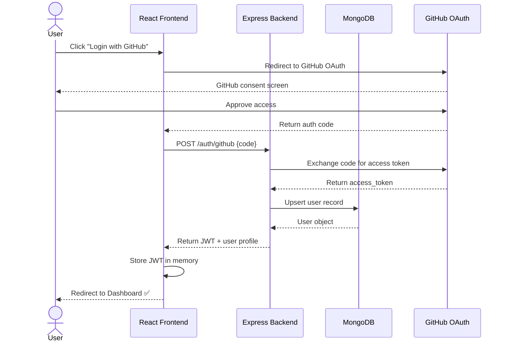
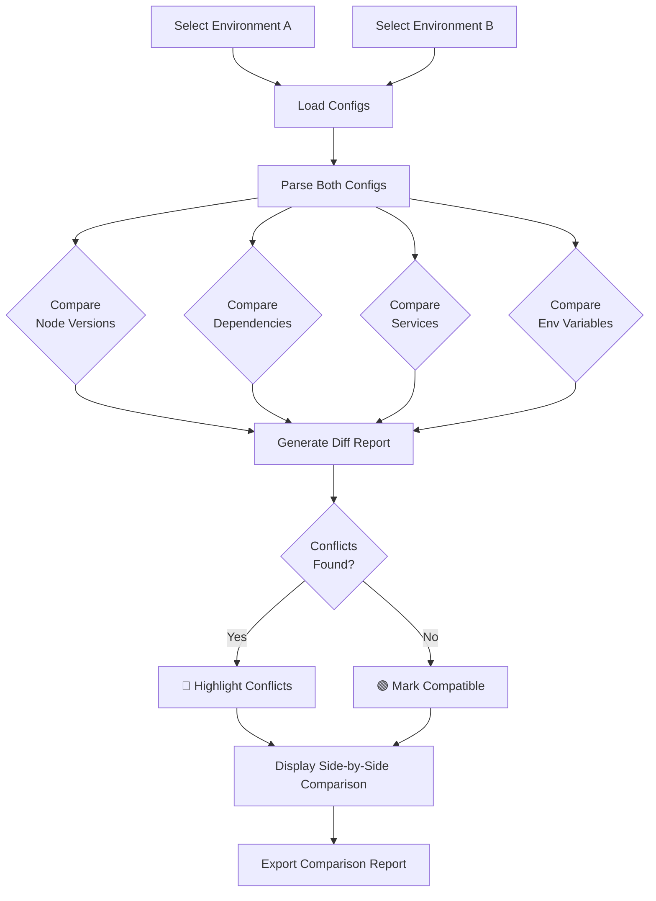

<div align="center">

# 🔄 DevSync

### Auto Environment Sync Platform

**Eliminate environment setup friction. Clone, sync, and code — instantly.**

[](https://reactjs.org/)
[](https://vitejs.dev/)
[](https://tailwindcss.com/)
[](https://nodejs.org/)
[](#license)

[Features](#-features) · [Architecture](#-system-architecture) · [Getting Started](#-getting-started) · [Screens](#-screens) · [Roadmap](#-roadmap)

</div>

---

## 🧩 The Problem

Every developer has been there — you clone a repository, run the project, and immediately hit a wall:

```
Error: Node version mismatch. Required: 18.x, Found: 16.x
MongooseError: MongoDB connection refused
Error: Missing environment variable REDIS_URL
```

DevSync eliminates this friction by **automatically analyzing repositories** and generating environment-ready configurations before you even write a line of code.

---

## 🌟 Features

| Feature | Description |
|---|---|
| 🔍 **Repository Analysis** | Deep scan of GitHub repos to detect stack, dependencies, and config needs |
| ⚙️ **Environment Detection** | Identifies Node.js versions, MongoDB, Redis, and Docker requirements |
| 🩺 **Health Monitoring** | Scores your environment's readiness and flags missing components |
| 🔀 **Environment Comparison** | Side-by-side diff of multiple environments to catch version mismatches |
| 📋 **Activity Logs** | Full scan history with detailed environment reports |
| 🔗 **GitHub Integration** | Connects directly to your GitHub account for seamless repo access |

---

## 🏗 System Architecture

The diagram below shows the high-level architecture of DevSync — from the user's browser to GitHub and back.

```
┌─────────────────────────────────────────────────────────────────┐
│                        DevSync Platform                         │
│                                                                 │
│   ┌──────────────────────┐        ┌──────────────────────────┐  │
│   │    React Frontend    │◄──────►│     Node.js Backend      │  │
│   │                      │  REST  │      (Planned)           │  │
│   │  • Dashboard         │  API   │  • Express.js            │  │
│   │  • Sync              │        │  • JWT Auth              │  │
│   │  • Environments      │        │  • Analysis Engine       │  │
│   │  • Compare           │        │  • Config Generator      │  │
│   │  • Logs              │        │                          │  │
│   │  • Settings          │        └──────────┬───────────────┘  │
│   └──────────────────────┘                   │                  │
│                                              │                  │
│                              ┌───────────────┼──────────────┐   │
│                              │               │              │   │
│                       ┌──────▼──────┐ ┌──────▼──────┐      │   │
│                       │  MongoDB    │ │ GitHub API  │      │   │
│                       │  (Storage)  │ │ (Repos)     │      │   │
│                       └─────────────┘ └─────────────┘      │   │
│                                                             │   │
└─────────────────────────────────────────────────────────────────┘
```

---

## 🔄 Core Workflows

### 1. Repository Analysis Flow



---

### 2. Environment Health Check Flow



---

### 3. User Authentication Flow



---

### 4. Environment Comparison Flow



---

## 📁 Project Structure

```
devsync-frontend/
├── public/
│   └── favicon.ico
│
├── src/
│   ├── routes/
│   │   └── AppRoutes.jsx          # Central route definitions
│   │
│   ├── layouts/
│   │   └── MainLayout.jsx         # Shared shell with Sidebar
│   │
│   ├── components/
│   │   ├── Sidebar.jsx            # Navigation sidebar
│   │   └── StatsCard.jsx          # Reusable metric card
│   │
│   ├── pages/
│   │   ├── Login.jsx              # GitHub OAuth entry point
│   │   ├── Dashboard.jsx          # Overview & health scores
│   │   ├── Sync.jsx               # Repo URL input & analysis
│   │   ├── Environments.jsx       # Detected env configurations
│   │   ├── Compare.jsx            # Side-by-side env diff
│   │   ├── Logs.jsx               # Scan history & reports
│   │   └── Settings.jsx           # Integrations & preferences
│   │
│   ├── hooks/                     # Custom React hooks (planned)
│   ├── utils/                     # Helper functions (planned)
│   │
│   ├── App.jsx                    # Root component
│   ├── main.jsx                   # React DOM entry point
│   └── index.css                  # Global styles (Tailwind)
│
├── index.html
├── vite.config.js
├── tailwind.config.js
└── package.json
```

---

## 🛠 Tech Stack

### Frontend (Current)

| Technology | Purpose |
|---|---|
| **React.js** | Component-based UI |
| **Vite** | Lightning-fast dev server & bundler |
| **Tailwind CSS** | Utility-first styling |
| **React Router DOM** | Client-side routing |
| **Lucide React** | Icon library |

### Backend (Planned)

| Technology | Purpose |
|---|---|
| **Node.js + Express.js** | REST API server |
| **MongoDB** | User data & scan history |
| **JWT** | Stateless authentication |
| **GitHub REST API** | Repository access & metadata |

### Infrastructure (Future)

| Technology | Purpose |
|---|---|
| **Redis** | Caching scan results |
| **Docker** | Containerized deployment |
| **AI/LLM** | Smart environment recommendations |

---

## 🚀 Getting Started

### Prerequisites

- Node.js `>= 18.x`
- npm `>= 9.x`
- Git

### Installation

**1. Clone the repository**

```bash
git clone https://github.com/Riyaban583/Auto-Environment-Sync-Platform.git
cd devsync-frontend
```

**2. Install dependencies**

```bash
npm install
```

**3. Configure environment**

```bash
cp .env.example .env
# Edit .env with your GitHub OAuth credentials
```

**4. Start the development server**

```bash
npm run dev
```

Open [http://localhost:5173](http://localhost:5173) in your browser.

### Build for Production

```bash
npm run build
npm run preview
```

---

## 🖥 Screens

| Screen | Description |
|---|---|
| **Login** | GitHub OAuth sign-in with clean landing UI |
| **Dashboard** | Overview of recent scans, health scores, and stats |
| **Repository Sync** | Paste a GitHub URL to trigger environment analysis |
| **Environments** | View all detected environment configurations |
| **Environment Comparison** | Side-by-side diff of two environments |
| **Activity Logs** | Full history of repository scans and reports |
| **Settings** | Manage GitHub integration and notification preferences |

---

## 🗺 Roadmap

```
Phase 1 — Foundation (Current)        Phase 2 — Backend Integration
──────────────────────────────         ──────────────────────────────
 ✅ React frontend scaffold             🔲 Node.js + Express API
 ✅ Routing & layout system             🔲 MongoDB data layer
 ✅ Dashboard UI                        🔲 GitHub OAuth
 ✅ Sync, Compare, Logs, Settings       🔲 Repository analysis engine
 ✅ Stats cards & sidebar               🔲 JWT authentication

Phase 3 — Intelligence                 Phase 4 — Scale & Collaboration
──────────────────────────────         ──────────────────────────────
 🔲 Redis caching layer                 🔲 Team collaboration features
 🔲 Docker Compose generation           🔲 Cloud deployment support
 🔲 AI-based recommendations           🔲 Real-time monitoring
 🔲 Auto env variable detection         🔲 Webhook integrations
 🔲 Repository auto-scan on push        🔲 VS Code extension
```


## 📄 License

This project is developed for **educational, academic, and hackathon** purposes.

---

<div align="center">

Made with ❤️ by the DevSync Team

*Stop configuring. Start coding.*

</div>
